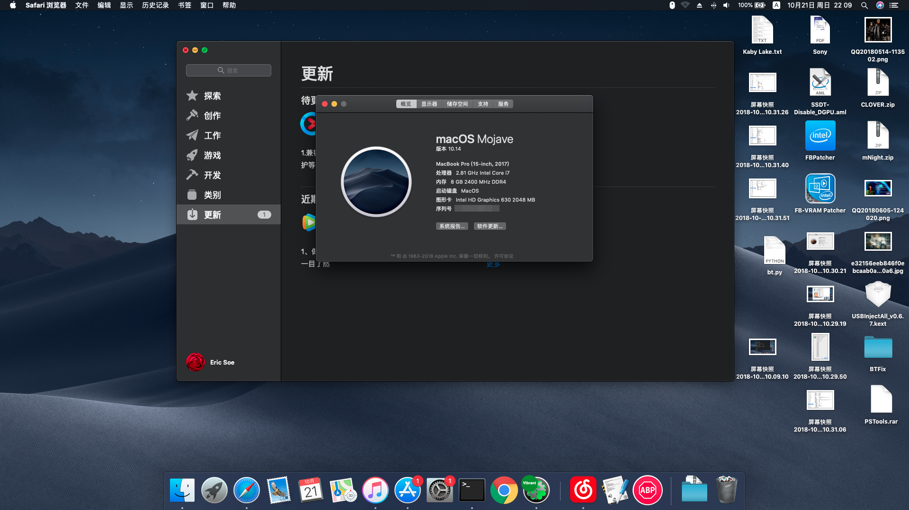
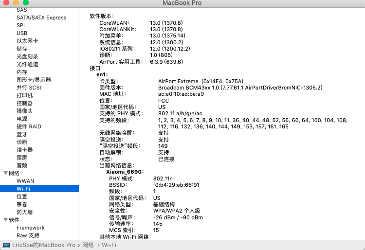
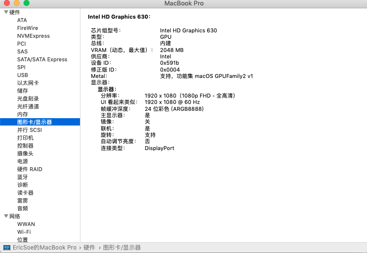
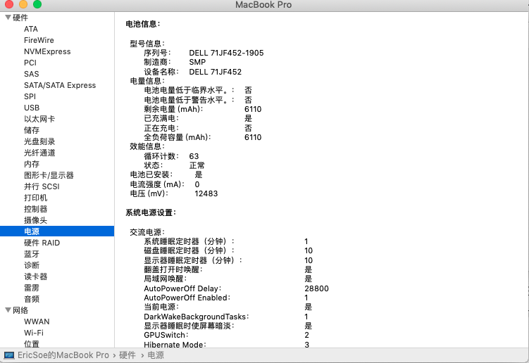
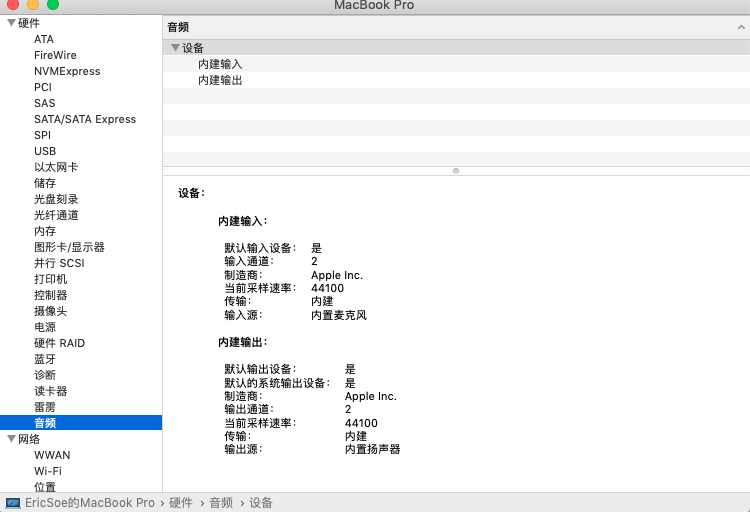
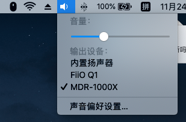
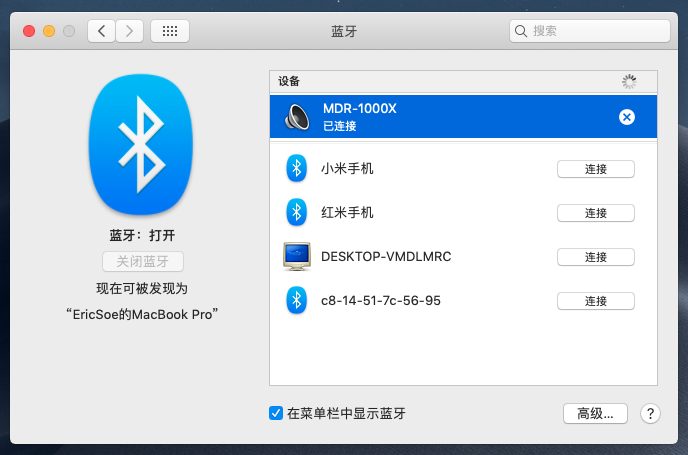
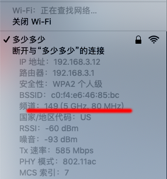
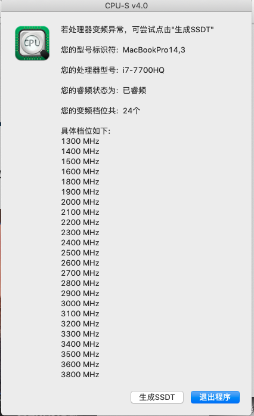

话不多说，先上配置

| 配置 / Hardware | 详情 / Detail|
| ------ | ------ | 
| 型号 / Model | Dell Inspiron 15 7000 Gaming (7567) |
| 操作系统 / OS | macOS Mojave 18A389 |
| 处理器 / CPU | Intel Core i7-7700HQ @ 2.80GHz |
| 内存 / Memory|  8 GB ( Hynix DDR4 2400MHz )|
| 硬盘 / HardDrive| Samsung SM961 256GB|
| 显卡 / Graphics Card| Intel HD Graphics 630 (platform-id:0x591B0000) |
| 声卡 / Sound Card | Realtek ALC256 ( layout-id:2/56 )|
| 网卡 / Network Card | Dell DW1820A ( BCM94350ZAE ) |

## 注意事项
* 1.适配系统：macOS 10.13 各版本到 10.14 （10.13 、10.13.6 、 10.14 已测试通过）

* 2.未使用ssdt-x.aml变频,已测试使用Clover仿冒MacBookPro14,3，完美变频。  

* 3.关于网卡:
	* (1).鉴于DW1820A的特殊性，每次重启请点击关机，然后手动重启，在windows，macos，linux系统下都是如此，否则会导致卡在卡在苹果图标第二屏，解决方法就是长按电源关机再开机即可解决。

	* (2).dw1820a未屏蔽针脚，wifi第一次连接时请不要连接电源适配器，连接上之后请不要切换其他wifi，也不要关闭再打开，会死机，要切换的话先把电源，在关机，之后按开机键开机，这一系列操作之后再切换，而且也只能切换一次。在升级或者安装系统时每次重启就卡住直接长按5S电源键就可以继续了。

	* (3).综上，慎重选择DW1820A，但DW1560和DW1830太贵。

## 图片欣赏

>5Ghz和2.4Ghz的蓝牙不冲突

>变频24档足够了吧

## 闲扯

&emsp;&emsp;网卡已经替换为dw1820a，这张网卡争议很大，有的设备能直接用，有的屏蔽触点之后能用，有的屏蔽之后还是不能用。不过亲测在使用5Ghz的路由器，蓝牙正常，WIFI也正常，蓝牙不会信号奇差、断断续续，猜测原因是蓝牙工作频段是2.4Ghz，和2.4GHz的wifi频率一样，形成干扰。另外这张卡在win10下使用毫无问题，驱动是提取自戴尔官方。

## 更新日志

* 2018.10.13
	* 1.首次发布，所有使用的驱动都是当前最新。
* 2018.11.24
	* 1.路由器使用了5Ghz，蓝牙正常！宿舍8M内都正常！听了20min不存在断开连接！
	* 2.USBInjectAll.kext 更新到2018-11-08 (0.7.1)，FakePCIID_Broadcom_WiFi.kext 和 FakePCIID.kext更新到2018-1027，来自RehubMan大神，感谢！！！
	* 3.更新几张图片（有的是上次截的，忘了放在这里面）。
* 2018.13.3
	* 添加了ALCPlugFix，这个补丁是用来修复耳机破音，源自网络 ，里面有用法说明，感谢制作此补丁的大婶！！！

## 如果你认可我的努力，可以通过 `打赏` 支持我后续的更新

|支付宝红包|微信 |支付宝|
| --- | --- | --- |
|||	|

## 感谢浏览！！！
